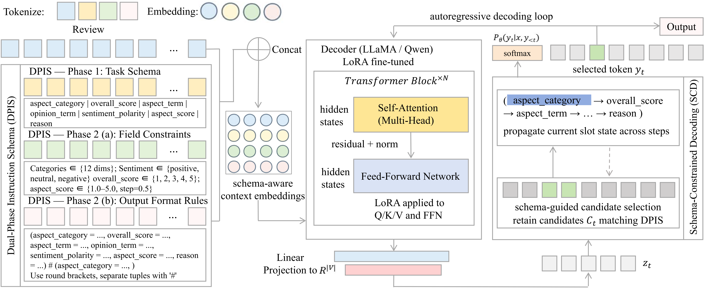

# TOUR-TUPLE-7
TOUR-TUPLE-7: A FINE-GRAINED 7-TUPLE GENERATIVE ASPECT-BASED SENTIMENT ANALYSIS BENCHMARK FOR TOURISM SERVICE QUALITY

This repository provides resources for **TOUR-TUPLE-7**, a manually annotated benchmark of 49,998 TripAdvisor reviews, each labeled with seven-field tuples  
(aspect category, aspect term, opinion term, sentiment polarity, aspect score, overall score, reason).  
The dataset enables unified evaluation of aspect-based sentiment analysis (ABSA) tasks including extraction, classification, regression, and explanation.

## Repository Structure
- `data/` – A small sample version of the dataset (train/dev/test splits) for demonstration.  
- `Seqtoseqbaseline/` – Baseline sequence-to-sequence training and evaluation scripts (e.g., T5, BART, T5 Large, BART Large).  
- `DPIS-SCD-LLM/` – LLM and Our proposed schema-aware generative framework with Dual-Phase Instruction Schema (DPIS) and Schema-Constrained Decoding (SCD).

## Usage
1. Install dependencies (Python 3.9+ and PyTorch >= 2.0 recommended).
2. Use `Seqtoseqbaseline` for training standard seq2seq baselines.
3. Use `DPIS-SCD-LLM` for fine-tunin LLama and Qwen ICL, fine-tuning, as well as DPIS-SCD and evaluation.

